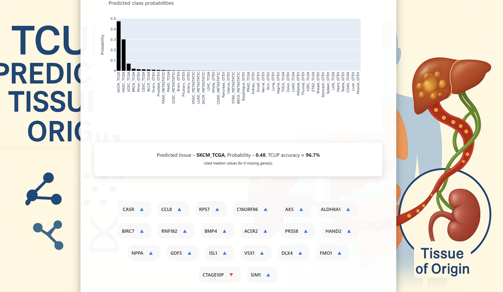

# TCUP – Tissue‑of‑Origin Prediction

**TCUP** (Tissue Classification Using Probabilities) is an open‑access Dash web‑application and model suite that predicts the most likely tissue of origin for:

* cancers of unknown primary (CUP)  
* any transcriptomic sample (e.g. TCGA, GTEx, metastatic, healthy)

The method couples a **Contrastive Auto‑Encoder (CAE)** for representation learning with a **Siamese Neural Network (SNN)** meta‑learner trained on curated TCGA, GTEx and metastatic cohorts. The embedding generated by both models are then fed to 5 base classifiers which are fine-tuned to elicit the best prediction through a Meta Learner (MLP).   For full methodology see the pre‑print:

> Landau O., Rubin E. “TCUP – Open Access Tool to Predict Tissue of Origin for Cancer of Unknown Primary (CUP) and Unknown Transcriptomic Samples” (in preparation, 2025).

---

## 🌳 Repository layout

```text
.
├── DashAppTCUP.py                         # Dash front-end (entry-point)
├── ExampleTranscriptomics.csv             # Toy input file
├── Median_Gene_Values_Cancer.pkl          # Gene-wise medians – cancer
├── Median_Gene_Values_Healthy.pkl         # Gene-wise medians – healthy
├── best_meta_learner_8.h5                 # Final MLP meta-learner
├── snn_model.h5                           # Siamese Neural Network backbone
├── cae_autoencoder_dual_loss.h5           # Contrastive Auto-Encoder (full)
├── cae_encoder.h5                         # Encoder only (inference-time)
├── cae_decoder.h5                         # Decoder only
├── trained_base_classifiers.pkl           # Five base classifiers (RF, XGB …)
├── monte_carlo_gene_importance_averaged.csv  # Gene-ablation scores (10 × MC)
├── test_split_metrics.csv                 # Per-class test metrics
│
├── assets/                                # CSS, logo, favicon
│   └── …
├── images/                                # Screenshots for the README
│   ├── LandingPage.png
│   └── ResultsPage.png
├── Raw Script/                            # End-to-end training pipeline
│   └── TCUP_raw_training_script.py
└── README.md                              # <–– you are here

```

### Key artefacts

| Path | Purpose |
|------|---------|
| **DashAppTCUP.py** | Launches the Dash UI & prediction pipeline |
| **Median_Gene_Values_Cancer.pkl** / **…_Healthy.pkl** | Per-gene medians used to impute missing genes and calculate over/under-expression |
| **snn_model.h5** | Siamese Neural Network generating sample embeddings |
| **cae_autoencoder_dual_loss.h5** | Contrastive Auto-Encoder (joint loss) – produces latent representation fed to base classifiers |
| **trained_base_classifiers.pkl** | Five fine-tuned base models (RF, XGB, LR, k-NN, SVM) that vote via the meta learner |
| **best_meta_learner_8.h5** | Multi-layer perceptron combining base classifier logits into final probabilities |
| **monte_carlo_gene_importance_averaged.csv** | Averaged single-gene ablation impact (10-run Monte-Carlo) – drives the “20 most influential genes” list |
| **test_split_metrics.csv** | Held-out test-set metrics, used to display *TCUP accuracy* for each tissue |
| **ExampleTranscriptomics.csv** | Minimal example showing the required file format for uploads |

> **Note** – raw expression matrices (TCGA, GTEx and metastatic cohorts) are **not included** due to size constraints. Contact *olandau4@gmail.com* to arrange data transfer if you plan to retrain TCUP.

---

## 🚀 Quick start

```bash
# 1. clone repo
git clone https://github.com/<your‑user>/tcup.git
cd tcup

# 2. install deps
python -m venv venv && source venv/bin/activate  # optional
pip install -r requirements.txt

# 3. launch Dash server
python app/app.py
```

The app starts on **http://127.0.0.1:8050** by default.

---

## 🖼  UI tour

| Landing | Results |
|---------|---------|
|  |  |

* **Landing page** – drag‑and‑drop a CSV/TSV where the **first column is `sample_id`** and the rest are *HGNC gene symbols*. Choose **Cancer** vs **Healthy** to select the assumed tissue type, this will add missing genes and compute the Over/Under expression of most significant genes in predicting the predicted label in your sample (from models intepertation stage - see paper) against the closest assumed reference data.  
* **Results page** – shows:  
  1. 49 class probabilities (barplot), top to bottom, left to right.  
  2. Predicted tissue + model‑confidence (bold) - Probabilities and Models accuracy for that label on the test set.  
  3. **TCUP accuracy** – historical accuracy for that tissue on an unseen test set (≈ accuracy for the given label).  
  4. The 20 most influential genes in the decision (blue ▲ = over‑expressed; red ▼ = under‑expressed).

---

## 📈 Interpreting the output

* **Predicted tissue** – the label (e.g. `SKCM_TCGA`) with the highest posterior probability.  
* **Probability** – the softmax score from the meta learner (0‑1).  
* **TCUP accuracy** – *held‑out* test‑set accuracy **for that tissue** only.  
  *Example*: “TCUP accuracy ≈ 96.7 %” means that, across the unseen test set melanoma (SKCM) samples were 96.7 %  correctly classified by TCUP.

If your sample’s probability is low (<0.4) or multiple tissues cluster tightly, treat the prediction with caution and consider further histopathological or molecular work‑up. We would advise to utilize the tool merely as 'advice', this is not clinicaly verified and should not be applited in clinical practifce.  

---

## 🛠  Retraining

1. Taw expression matrices (TCGA, GTEx, metastatic) were not uploaded due to the significant size of the files, to use the data for potential retraining contact us - olandau4@gmail.com - and we will find a solution to transfer the data. 
2. Once data obtained, paths for the read_csv functions should be changed and matched to your enviorment.
3. install all depdencies (requirements.txt)
4. Run `python FullTCUP.py`.  


```
images/
├─ landing_page.png
└─ results_page.png
```
---

## 📜 Citation

If you use TCUP in academic work, please cite the forthcoming pre‑print:

```
Landau O., Rubin E. TCUP – Open Access Tool to Predict Tissue of Origin
for Cancer of Unknown Primary (CUP) and Unknown Transcriptomic Samples. 2025.
```

---
